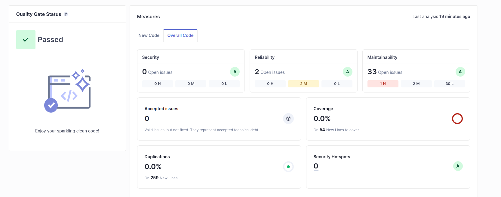
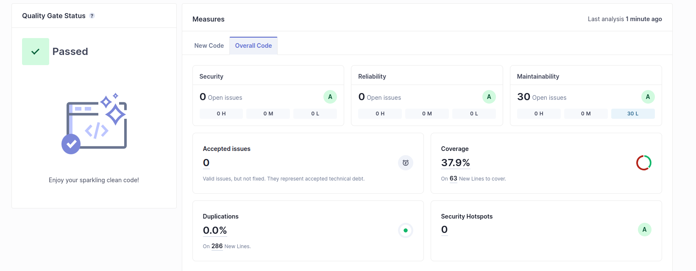

# Technical debt (Cars)

## Test Results

Following command:
```
mvn clean verify sonar:sonar   -Dsonar.projectKey=cars   -Dsonar.projectName='cars'   -Dsonar.host.url=http://127.0.0.1:9000   -Dsonar.token=sqp_efe7f0603b01ff8218a847050e5dbc3764f06914
```

Initial my project successfully passed the Quality Gate, with 0 bugs, 0 vulnerabilities abd 0 Security Hotspot.



## Technical Debt

Debt is the the estimated amount of effort (using time), it is expected to take in order to solve all code smells detected.
In my code the effort is 1h 44min

## Code Smells Reported


Change this
```
@Autowired
    private CarManagerService carManagerService;
```
to this
```
 private final CarManagerService carManagerService;

    public CarController(CarManagerService carManagerService) {
        this.carManagerService = carManagerService;
    }
```


## Jacoco Plugin

```
 <!-- Jacoco runner to inspect code coverage -->
            <plugin>
                <groupId>org.jacoco</groupId>
                <artifactId>jacoco-maven-plugin</artifactId>
                <version>0.8.8</version>
                <executions>
                    <execution>
                        <goals>
                            <goal>prepare-agent</goal>
                        </goals>
                    </execution>
                    <execution>
                        <id>report</id>
                        <phase>prepare-package</phase>
                        <goals>
                            <goal>report</goal>
                        </goals>
                    </execution>
                </executions>
            </plugin>

```


With Jacoco installed, we could test the coverage, that resulted in 37,9% (with 30 uncovered lines and 29 uncovered conditions).
