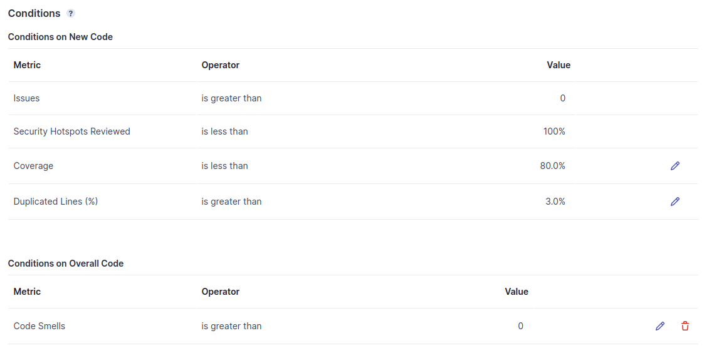
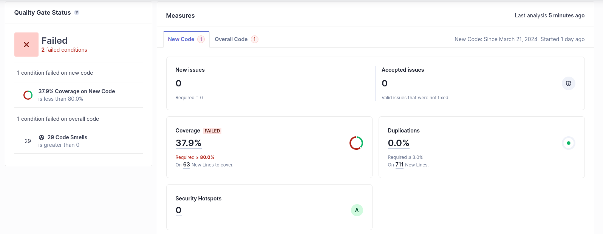

# Costum Quality-Gate

For this exercise, I used the example from the previous exercise, due to having some essues trying to use my previous IES work. 
Alghout with a custum quality gate based onthe default quality gate my code did not pass because of de coverage (greater tha 80%), I added the following rule:

- Code Smells is greater than 0

This was done purely in order to break the quality gate conditions. The code did not pass as expected.

